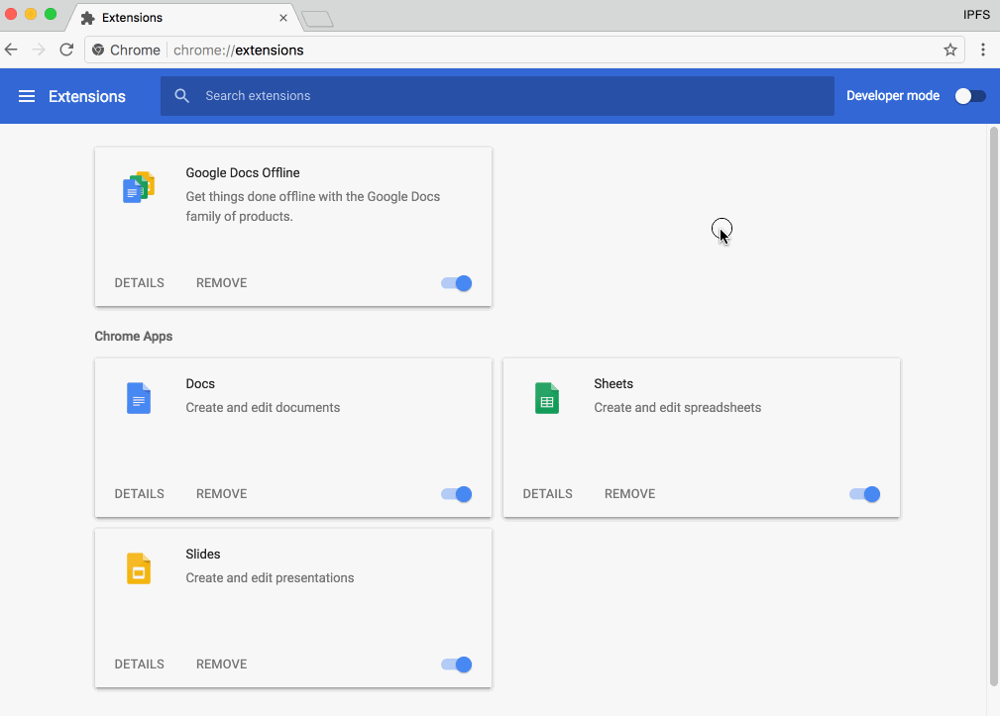
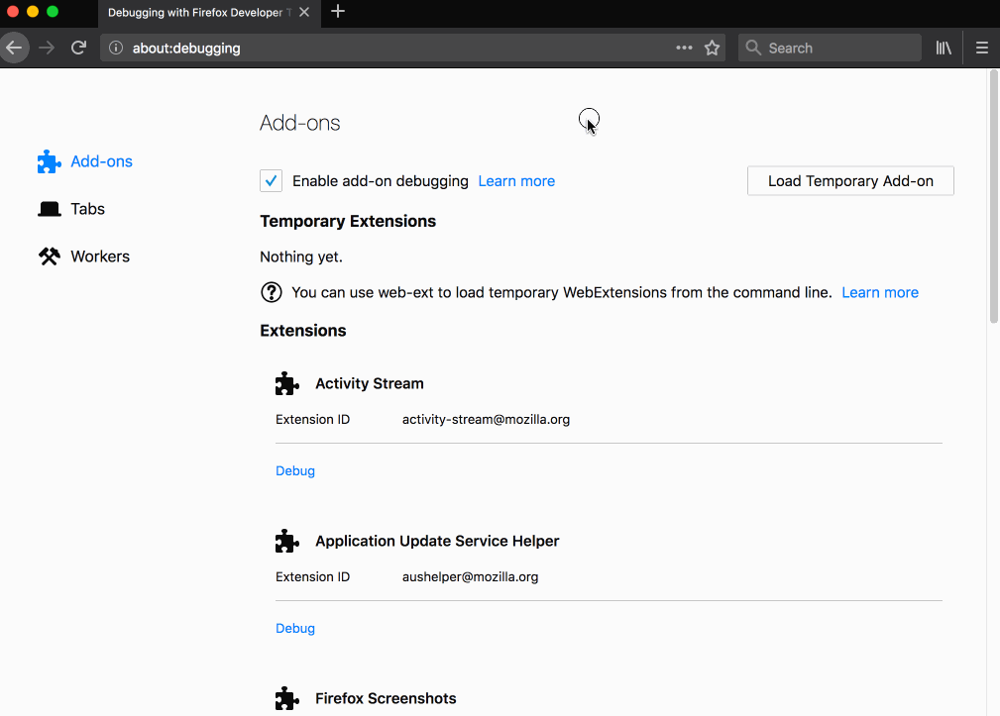

# Developer Notes for IPFS Companion

### Table of Contents

* [Build from Sources](#build-from-sources)
    * [Installing Dependencies](#installing-dependencies)
    * [Build and Run in Firefox](#build-and-run-in-firefox)
    * [Build and Manual Install in Chromium](#build-and-manual-install-in-chromium)
* [Useful Tasks](#useful-tasks)
* [Tips](#tips)
* [Firefox for Android](#firefox-for-android)


## Build from Sources

You will need [NodeJS](https://nodejs.org/) and [Firefox](https://www.mozilla.org/en-US/firefox/developer/). Make sure `npm` and `firefox` are in your `PATH`.

It may be a good idea to use `yarn` instead of `npm`. We provide `yarn.lock` if you choose to do so.

### Installing Dependencies

To install all dependencies into `node_modules` directory, execute:

```bash
npm install
```

### Build and Run in Firefox

One stop command to build, test and deploy add-on to Firefox:

```bash
npm start        # all-in-one
```

To do each step manually:
```bash
npm run build    # build runs bundle:firefox at the end, so manifest will be ok
npm run test     # test suite
npm run firefox  # spawn new Firefox
```

It is also possible to load extension manually: enter `about:debugging` in the URL bar
then click "Load Temporary Add-on" and point it at `add-on/manifest.json`

### Build and Manual Install in Chromium

First, build it manually:

```bash
npm run build bundle:chromium # last part is important: it overwrites manifest
```

Then open up `chrome://extensions` in Chromium-based browser, enable "Developer mode", click "Load unpacked extension..." and point it at `add-on`

| Chrome "unpacked extension" | Firefox "temporary add on" |
|-----------------------------|----------------------------|
|  |  |


## Useful Tasks

Each `npm` task can be run separately, but for most of time `dev-build`, `test` and `fix:lint` are all you need.

- `npm install` -- install all NPM dependencies
- `npm run build` -- build the add-on (copy external libraries, create `.zip` bundles for Chrome and Firefox)
- `npm run bundle:chromium` -- overwrites manifest and packages a generic, Chromium-compatible version
- `npm run bundle:brave` -- overwrites manifest and packages a Brave-compatible version requesting access to `chrome.sockets`
- `npm run bundle:firefox` -- overwrites manifest and packages a Firefox-compatible version
- `npm run build:rename-artifacts` -- renames artifacts to include runtimes in filenames
- `npm run ci` -- runs tests and build (with frozen yarn.lock)
- `npm test` -- run entire test suite
- `npm run lint` -- read-only check for potential syntax problems (run all linters)
- `npm run fix:lint` -- try to fix simple syntax problems (run `standard` with `--fix` etc)
- `npm run lint:standard` -- run [standard](http://standardjs.com) linter ([IPFS JavaScript projects default to standard code style](https://github.com/ipfs/community/blob/master/js-code-guidelines.md#linting--code-style))
- `npm run lint:web-ext` -- run [addons-linter](https://github.com/mozilla/addons-linter) shipped with `web-ext` tool
- `npm run firefox` -- run as temporary add-on in Firefox
- `npm run chromium` -- run as temporary add-on in Chromium
- `npm run get-firefox-nightly` -- fetch latest Firefox Nightly to `./firefox/`
- `npm run firefox:beta:add -- --update-link "https://host/path/to/file.xpi" file.xpi` -- add a manifest entry for new self-hosted Beta for Firefox

Release build shortcuts:
- `npm run dev-build` -- all-in-one: fast dependency install, build with yarn (updates yarn.lock if needed)
- `npm run beta-build` -- reproducible beta build in docker with frozen yarn.lock
- `npm run release-build` -- reproducible release build in docker with frozen yarn.lock

## Tips

- You can switch to alternative Firefox version by overriding your `PATH`:

  ```bash
  export PATH="/path/to/alternative/version/of/firefox/:${PATH}"
  ```

- [Localization Notes](LOCALIZATION-NOTES.md) (running browsers with specific locale etc)
- [Testing persistent and restart features](https://developer.mozilla.org/en-US/Add-ons/WebExtensions/Testing_persistent_and_restart_features)

## Firefox for Android

Firefox for Android is capable of running some of extensions as desktop version.

It makes it very useful for IPFS experimentation.

### Install Firefox for Android

All channels are available at Google Play Store:

- [Latest Stable](https://play.google.com/store/apps/details?id=org.mozilla.firefox&hl=en)
- [Latest Beta](https://play.google.com/store/apps/details?id=org.mozilla.firefox_beta)

### Install IPFS Companion

See [`README/#install`](https://github.com/ipfs-shipyard/ipfs-companion#install).
Developers can also test the latest code locally on emulator or via USB on own device (see below).

## Hot-deploy over USB

To run your extension in [Firefox for Android](https://www.mozilla.org/en-US/firefox/mobile/), follow these instructions:

- [Set up your computer and Android emulator or device](https://developer.mozilla.org/en-US/docs/Mozilla/Add-ons/WebExtensions/Developing_WebExtensions_for_Firefox_for_Android#Set_up_your_computer_and_Android_emulator_or_device) (enable Developer Mode, USB Debugging etc)

Build everything and switch `add-on/manifest.json` to Fennec profile:

```
npm run dev-build
npm run bundle:fennec
```

With device connected to your development computer, run:

```
web-ext run -s add-on --target=firefox-android
```

It will list all connected devices with their IDs. If the list is empty, go back to the setup step.

Next, deploy extension to the specific device:

```
web-ext run -s add-on --target=firefox-android --android-device=<device ID>
```

The first time you run this command there may be a popup on your Android device asking if you want to grant access over USB.

## Debugging in Firefox for Android

Remote debug port will be printed to console right after successful deployment:

```
You can connect to this Android device on TCP port <debug PORT>
```

The fastest way to connect is to open `chrome://devtools/content/framework/connect/connect.xhtml` in Firefox the same machine you run `web-ext` from.

## References

- [MDN: Developing extensions for Firefox for Android](https://developer.mozilla.org/en-US/Add-ons/WebExtensions/Developing_WebExtensions_for_Firefox_for_Android)
