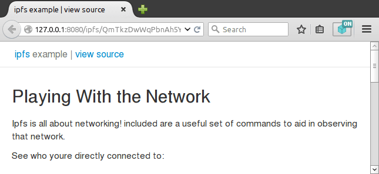

| **Read This First** |
| --- |
| This branch contains sources of legacy versions `1.x.x`.|
| Maintenance of this codebase stopped in 2016 and is left for historical purposes.    
| Since then [add-on was migrated to the new API called WebExtensions](https://github.com/ipfs/ipfs-companion/issues/20) and was released as `2.x.x`. |
| For up-to-date sources switch to `master` branch.|


# ipfs-firefox-addon AKA “IPFS Gateway Redirect”




> Firefox addon that provides transparent access to IPFS resources via local HTTP2IPFS gateway.

(If you are using Google Chrome or Chromium check [ipfs-chrome-extension](https://github.com/dylanPowers/ipfs-chrome-extension) or [ipfs-chrome-station](https://github.com/xicombd/ipfs-chrome-station) instead)

## Table of Contents

- [Background](#background)
- [Features](#features)
- [Install](#install)
- [Contribute](#contribute)
- [License](#license)

## Background

This add-on enables everyone to access ipfs.io (or any other public gateway) urls the way they were meant: from locally running IPFS daemon :-)

IPFS is a new hypermedia distribution protocol, addressed by content and identities.
IPFS enables the creation of completely distributed applications.
It aims to make the web faster, safer, and more open.

Learn more at: https://ipfs.io (It is really cool, I promise!)

## Features

- Toolbar icon displays current IPFS peering status
- Click on it to open IPFS actions menu
  - Display information about custom gateway
  - Toggle redirection to the gateway (ON by default)
  - Open WebUI (eg. go-ipfs daemon running at the custom gateway)
  - Additionally, on pages loaded from IPFS:
    - Pin IPFS Resource (via API)
    - Copy canonical IPFS address
    - Copy shareable URL to resource at a default public gateway (first one on public gateway list)
- Requests to `https?://<public_gateway>/(ipfs|ipns)/$RESOURCE`  
  are replaced with `http://127.0.0.1:8080/(ipfs|ipns)/$RESOURCE`
- Custom Gateway address and other settings can be tweaked at   
  `about:addons` → Extensions → IPFS Gateway Redirect → Preferences
- Requests made via popular custom protocols are routed to the active gateway (public or custom):
   - `[web+](ipfs|ipns):/*$RESOURCE`
   - `[web+]fs:/*(ipfs|ipns)/$RESOURCE`
- Experimental features (disabled by default, use Preferences screen to enable)
   - Automatic Mode: enable/disable redirect based on the number of peers
   - Detect and redirect sites with [dnslink](https://github.com/jbenet/go-dnslink) to `/ipns/<fqdn>`
   - Rewrite hrefs with `/ip(f|n)s/*` paths on every page to point to IPFS gateway. Make plaintext IPFS links clickable.

## Install

Install the latest signed release from [AMO](https://addons.mozilla.org/en-US/firefox/addon/ipfs-gateway-redirect/):

[](https://addons.mozilla.org/en-US/firefox/addon/ipfs-gateway-redirect/)

It will guarantee automatic updates to the latest version reviewed by Mozilla community.

### Manual Build

It is also possible to manually build XPI from [the latest relase sources](https://github.com/lidel/ipfs-firefox-addon/releases/latest),
however offical Firefox builds will not accept unsigned XPI package (only a developer version of Firefox can be used to run it).

Please read [SECURITY.md](https://github.com/lidel/ipfs-firefox-addon/blob/master/SECURITY.md) if you want to perform quick security audit BEFORE installation.

### TROUBLESHOOTING

#### Rule to work with NoScript with ABE enabled

By default [NoScript](https://addons.mozilla.org/en-US/firefox/addon/noscript/) breaks this addon by blocking assets loaded from IPFS Gateway running on localhost.    
To make it work, one needs to extend the SYSTEM Rulset and prepend it with IPFS whitelist:

```
# Enable IPFS redirect to LOCAL
Site ^http://127.0.0.1:8080/(ipfs|ipns)*
Anonymize

# Prevent Internet sites from requesting LAN resources.
Site LOCAL
Accept from LOCAL
Deny
```

Feel free to modify it, but get familiar with [ABE rule syntax](https://noscript.net/abe/abe_rules.pdf) first.

## Contribute

See [CONTRIBUTING](CONTRIBUTING.md)

PRs are welcome.

## License

[IPFS logo](https://github.com/ipfs/logo) belongs to [The IPFS Project](https://github.com/ipfs) and is licensed under a <a rel="license" href="https://creativecommons.org/licenses/by-sa/3.0/legalcode">CC-BY-SA 3.0</a>.

[is-ipfs](https://github.com/xicombd/is-ipfs), [js-multihash](https://github.com/jbenet/js-multihash) and other NPM dependencies are under MIT license.

The add-on itself is released under [CC0](LICENSE): to the extent possible under law, the author has waived all copyright and related or neighboring rights to this work, effectively placing it in the public domain.
