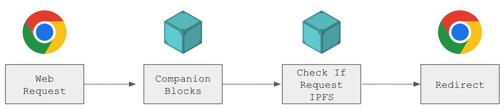
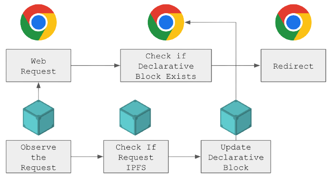

# MV3 Migration

## Overview

This document describes the migration process from MV2 to MV3. MV3 is a new version of the extension manifest format that fundamentally changes the way extensions are loaded and run in the browser. A few notable changes have been discussed in this [thread](https://discuss.ipfs.tech/t/announcing-ipfs-companion-mv3-rc-beta/16442) and a detailed plan can be found [here](https://github.com/ipfs/ipfs-companion/issues/1152).

## Implementation

The most important change that lead to this migration was how url request interception model was changed. In MV2, we used `webRequest.onBeforeRequest` to intercept requests and redirect them to the local gateway. That process looked something like:



The process was simple and synchronous, the request is intercepted and handed over to companion, which then redirects it to the local gateway as needed. MV3 changes this process by introducing a new API called `declarativeNetRequest`. MV3 does not allow synchronous request interception (also called blocking request), which is not secure and can lead to performance issues. Instead, it uses a declarative approach where the extension declares a set of rules that are then used by the browser to intercept requests. This process looks something like:



The process is asynchronous, the browser allows "observation" of requests to companion, which asynchronously determines if the given request is serviceable by IPFS and then dynamically introduces a rule for the browser to perform redirects to the local gateway. A sample rule looks something like:

```js
{
  id,                                    // random id for reference
  priority: 1,                           // priority of the rule
  action: {
    type: 'redirect',
    redirect: { '<regex substitution>' } // redirect to gateway
  },
  condition: {
    '<regex filter>',                    // filter to match requests
    '<filtered domains list>,
    resourceTypes: [
      'csp_report',
      'font',
      'image',
      'main_frame',
      'media',
      'object',
      'other',
      'ping',
      'script',
      'stylesheet',
      'sub_frame',
      'webbundle',
      'websocket',
      'webtransport',
      'xmlhttprequest'
    ]
  }
}
```

The API only allows for 5000 such rules to exist at the time of writing this, so that value can be exhausted pretty quickly. So instead of adding one rule per redirect, we can dynamically generate a single regex pattern to handle multiple redirections.

For example

```
https://ipfs.io/ipns/en.wikipedia-on-ipfs.org -> http://localhost:8080/ipns/en.wikipedia-on-ipfs.org
```

can be represented as

```
https://ipfs.io/ipns/(.*) -> http://localhost:8080/ipns/$1
```

That's just an example, but in reality it looks more like (which covers edge cases like URL endings):

```js
{
  "action": {
    "redirect": {
      "regexSubstitution": "http://localhost:8080\\1"
    },
    "type": "redirect"
  },
  "condition": {
    "excludedInitiatorDomains": [],
    "regexFilter": "^https?\\:\\/\\/ipfs\\.io((?:[^\\.]|$).*)$",
    "resourceTypes": [
      "csp_report",
      "font",
      "image",
      "main_frame",
      "media",
      "object",
      "other",
      "ping",
      "script",
      "stylesheet",
      "sub_frame",
      "webbundle",
      "websocket",
      "webtransport",
      "xmlhttprequest"
    ]
  },
  "id": 1234,
  "priority": 1
}
```

This is a single rule that covers all the redirects from `ipfs.io` to `localhost:8080`. This means that we can save a lot of rules and gain more coverage of serviceable URLs. This is the approach we have taken in MV3.

## Gotchas

Since the process is asynchronous, there are a few things that we need to keep in mind:

- There will always be scenarios, where the redirection to public URL happens before companion determines if the URL is serviceable (consider ipns/fqdn resolutions.) To tackle this a refresh mechanism has been put in place that refreshes the page after a few seconds if the URL is serviceable. This is not ideal, but it is the best we can do for now.
- Similarly there are scenarios around page recovery, where the page starts redirection, but the kubo node goes offline, in which case companion needs to remove offending rule and replace it with the recovery URL.
- If the kubo rpc api url changes for some reason, companion needs to update the rules to reflect the new URL. We can preemptively generate new rules based on the new url, but the new node might not be servicing the old content, so we need to be careful about that. Hence, we remove all such rules as offending and begin the process of generating new rules dynamically.
- Metrics collection becomes harder, as we can no longer reliably determine if the requested resource was serviced by declarative rule introduced by companion. We can only determine if the request was serviceable and we had a rule. We can probably introduce a content script to every page and redirect with a hash value in the URL. That content script can then invoke a companion API to notify what rule id was used to redirect the request. This is a future improvement.

## Other Thoughts

Not intercepting requests synchronously has it's quirks, but implementing a dynamic ruleset of possible redirects is even more complicated. Personally we're noticing improvements in second load times as the browser no longer relies on companion to intercept requests and redirect them. Instead declarative rule set allows for redirection to happen at the browser level, which is much faster. This also means that companion is no longer a bottleneck for the browser, which is a good thing.
