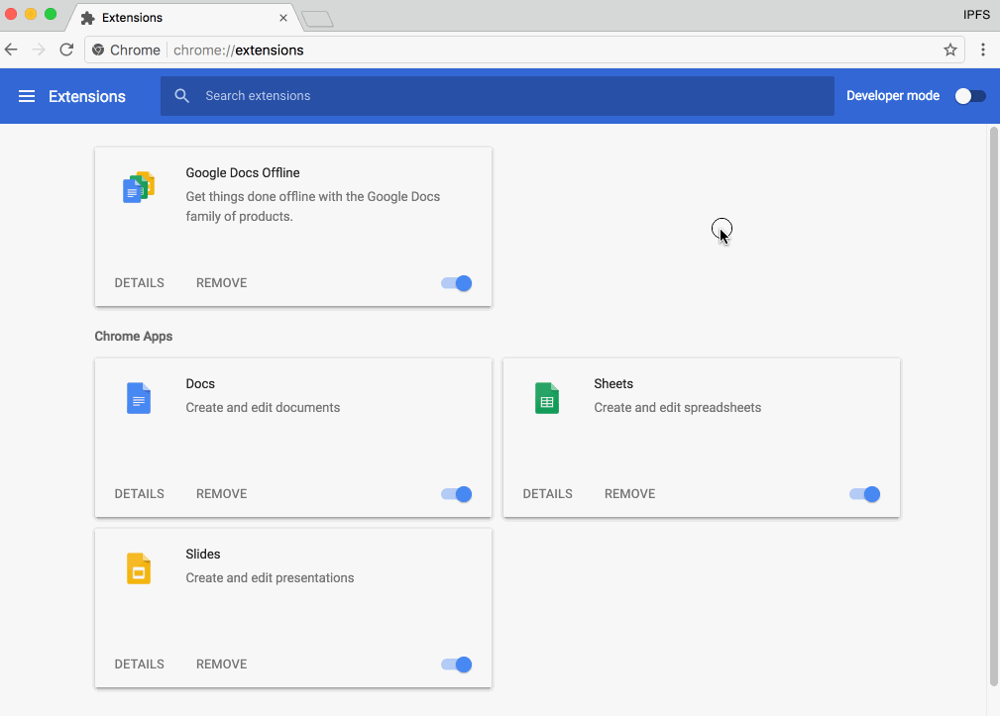
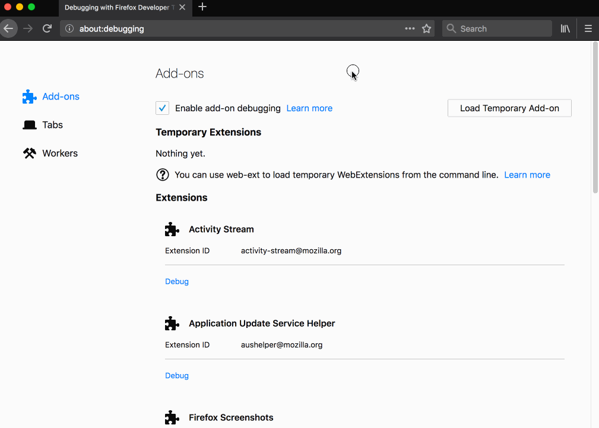

# Developer Notes for IPFS Companion

### Table of Contents

* [Build from Sources](#build-from-sources)
    * [Installing Dependencies](#installing-dependencies)
    * [Build and Run in Firefox](#build-and-run-in-firefox)
    * [Build and Manual Install in Chromium](#build-and-manual-install-in-chromium)
    * [Firefox for Android](#firefox-for-android)
    * [Libdweb with Firefox Nightly](#libdweb)
* [Useful Tasks](#useful-tasks)
* [Tips](#tips)


## Build from Sources

You will need [NodeJS](https://nodejs.org/) and [Firefox](https://www.mozilla.org/en-US/firefox/developer/). Make sure `npm` and `firefox` are in your `PATH`.

It may be a good idea to use `yarn` instead of `npm`. We provide `yarn.lock` if you choose to do so.

### Installing Dependencies

To install all dependencies into `node_modules` directory, execute:

```bash
npm install
```

### Build and Run in Firefox

One stop command to build, test and deploy add-on to Firefox:

```bash
npm start        # all-in-one
```

To do each step manually:
```bash
npm run build    # build runs bundle:firefox at the end, so manifest will be ok
npm run test     # test suite
npm run firefox  # spawn new Firefox
```

It is also possible to load extension manually: enter `about:debugging` in the URL bar
then click "Load Temporary Add-on" and point it at `add-on/manifest.json`

### Build and Manual Install in Chromium

First, build it manually:

```bash
npm run build bundle:generic # last part is important: it overwrites manifest
```

Then open up `chrome://extensions` in Chromium-based browser, enable "Developer mode", click "Load unpacked extension..." and point it at `add-on`

| Chrome "unpacked extension" | Firefox "temporary add on" |
|-----------------------------|----------------------------|
|  |  |


### Firefox for Android

See [`docs/firefox-for-android.md`](firefox-for-android.md)

### libdweb

See [`docs/libdweb.md`](libdweb.md)

## Useful Tasks

Each `npm` task can be run separately, but for most of time `dev-build`, `test` and `fix:lint` are all you need.

- `npm install` -- install all NPM dependencies
- `npm run build` -- build the add-on (copy external libraries, create `.zip` bundles for Chrome and Firefox)
- `npm run bundle:generic` -- overwrites manifest and packages a Brave/Chrome-compatible version
- `npm run bundle:firefox` -- overwrites manifest and packages a Firefox-compatible version
- `npm run ci` -- runs tests and build (with frozen yarn.lock)
- `npm test` -- run entire test suite
- `npm run lint` -- read-only check for potential syntax problems (run all linters)
- `npm run fix:lint` -- try to fix simple syntax problems (run `standard` with `--fix` etc)
- `npm run lint:standard` -- run [standard](http://standardjs.com) linter ([IPFS JavaScript projects default to standard code style](https://github.com/ipfs/community/blob/master/js-code-guidelines.md#linting--code-style))
- `npm run lint:web-ext` -- run [addons-linter](https://github.com/mozilla/addons-linter) shipped with `web-ext` tool
- `npm run firefox` -- run as temporary add-on in Firefox

Release build shortcuts:
- `npm run dev-build` -- all-in-one: fast dependency install, build with yarn (updates yarn.lock if needed)
- `npm run beta-build` -- reproducible beta build in docker with frozen yarn.lock
- `npm run release-build` -- reproducible release build in docker with frozen yarn.lock

## Tips

- You can switch to alternative Firefox version by overriding your `PATH`:

  ```bash
  export PATH="/path/to/alternative/version/of/firefox/:${PATH}"
  ```

- [Localization Notes](localization-notes.md) (running browsers with specific locale etc)
- [Testing persistent and restart features](https://developer.mozilla.org/en-US/Add-ons/WebExtensions/Testing_persistent_and_restart_features)

